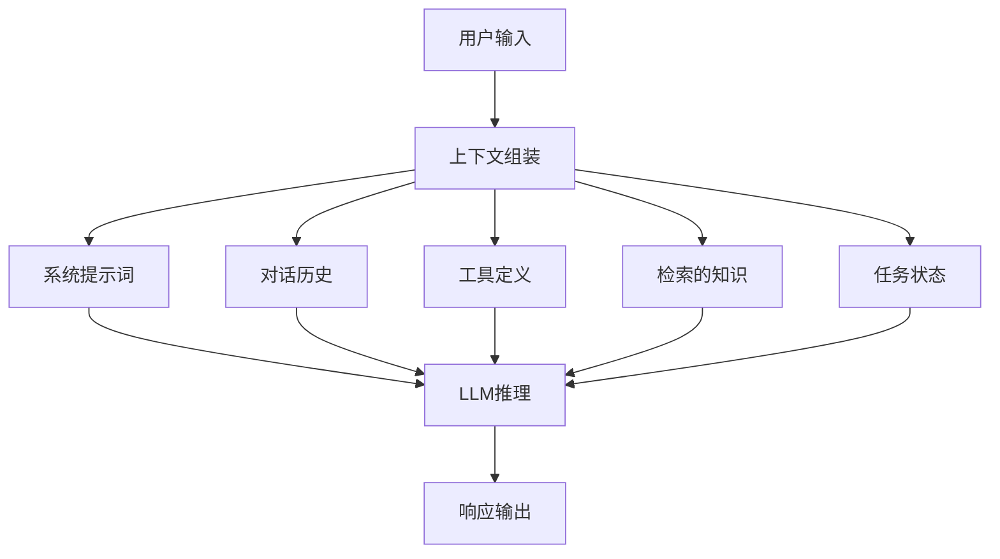

# Agent上下文管理理论详解

## 目录
1. [核心概念](#核心概念)
2. [上下文工程基础](#上下文工程基础)
3. [上下文层次结构](#上下文层次结构)
4. [上下文窗口特性](#上下文窗口特性)
5. [上下文优化原则](#上下文优化原则)
6. [记忆系统架构](#记忆系统架构)
7. [场景化策略](#场景化策略)
8. [上下文评估](#上下文评估)

---

## 核心概念

### 1.1 什么是上下文（Context）

**定义**：上下文是指在大语言模型（LLM）采样时包含的所有token集合。



**上下文的组成要素**：
- **指令层**：系统提示词、任务描述
- **历史层**：对话历史、操作日志
- **知识层**：检索到的文档、代码片段
- **状态层**：任务状态、变量值、环境信息
- **工具层**：可用的工具定义和说明

### 1.2 上下文窗口（Context Window）

**定义**：LLM在单次推理中能处理的最大token数量限制。

**限制因素**：
- **模型架构**：Transformer注意力机制的二次复杂度
- **硬件约束**：显存容量和计算资源
- **推理成本**：token数直接影响API成本
- **性能影响**：长上下文增加推理延迟

**典型容量**（2024-2025年主流模型）：
- GPT-4o: 128K tokens
- Claude 3.5: 200K tokens
- Gemini 1.5 Pro: 1M tokens
- 开源模型（Llama 3等）: 8K-128K tokens

### 1.3 上下文工程（Context Engineering）

**定义**：设计、治理和优化LLM周围的完整信息配置，以实现预期行为的学科。

**从Prompt Engineering到Context Engineering的演进**：

| 维度 | Prompt Engineering | Context Engineering |
|------|-------------------|---------------------|
| 关注点 | 文字和短语的选择 | 信息配置的整体设计 |
| 范围 | 单个提示词 | 整个上下文生态系统 |
| 目标 | 优化单次输出 | 优化系统整体行为 |
| 复杂度 | 线性优化 | 系统级优化 |
| 涉及组件 | 文本 | 提示词、记忆、工具、数据 |

**核心思想 - "Thinking in Context"**：
> 不仅仅考虑"该说什么"，而是考虑"在当前配置下，模型可能会做什么"

---

## 上下文工程基础

### 2.1 上下文的效用函数

**目标**：在token约束下最大化上下文的效用值。

```
Utility(Context) = Σ (Relevance × Importance × Recency)
```

**关键维度**：
- **相关性（Relevance）**：与当前任务的相关程度
- **重要性（Importance）**：信息对决策的关键程度
- **时效性（Recency）**：信息的时间新鲜度
- **密度（Density）**：单位token的信息量

### 2.2 上下文质量指标

**信息密度（Information Density）**：
```
密度 = (信息量 / Token数)
```

**冗余度（Redundancy）**：
```
冗余度 = 重复信息 / 总信息量
```

**注意力分散度（Attention Dispersion）**：
```
分散度 = 1 - (关键信息占比)
```

**上下文衰减（Context Decay）**：
- 早期信息在长上下文中容易被"遗忘"
- 模型注意力机制对位置敏感
- 关键信息应放置在关键位置（开头/结尾）

### 2.3 上下文工程的核心原则

**原则1：渐进式披露（Progressive Disclosure）**
```
阶段1: 元数据（~100 tokens）
  → 快速发现和匹配相关能力

阶段2: 指令（<5000 tokens）
  → 加载详细的操作指南

阶段3: 资源（按需）
  → 仅在需要时加载详细信息
```

**原则2：分层上下文（Hierarchical Context）**
```
全局层: 系统级规则、安全约束
  ├─ 任务层: 当前目标、工作流定义
  ├─ 会话层: 对话历史、用户偏好
  └─ 操作层: 当前步骤、局部状态
```

**原则3：上下文压缩（Context Compression）**
- **摘要压缩**：提炼关键信息
- **结构化压缩**：将自然语言转为结构化数据
- **符号化压缩**：使用简洁的表示法

**原则4：上下文缓存（Context Caching）**
- 静态内容缓存（系统提示词、工具定义）
- 会话级缓存（重复访问的知识）
- 动态预加载（预测性加载）

---

## 上下文层次结构

### 3.1 Agent Skills标准层次

```
skill-name/
├── SKILL.md                    # 必需
│   ├── Frontmatter (100 tokens)
│   │   ├── name
│   │   ├── description
│   │   └── metadata
│   └── Body (5000 tokens推荐)
│       ├── 使用场景
│       ├── 操作步骤
│       ├── 示例和模板
│       └── 边界情况
├── scripts/                    # 可选
│   ├── execute.py
│   └── helpers.sh
├── references/                 # 可选
│   ├── REFERENCE.md
│   ├── FORMS.md
│   └── domain-specific.md
└── assets/                     # 可选
    ├── templates/
    ├── diagrams/
    └── data/
```

**渐进式加载策略**：
1. **启动时**：所有技能的Frontmatter（元数据）
2. **激活时**：选定技能的SKILL.md主体
3. **运行时**：按需加载scripts、references、assets

### 3.2 上下文的多层架构

```
┌─────────────────────────────────────────┐
│          应用级上下文                   │
│  ┌───────────────────────────────────┐  │
│  │       Agent级上下文               │  │
│  │  ┌─────────────────────────────┐  │  │
│  │  │      任务级上下文           │  │  │
│  │  │  ┌───────────────────────┐  │  │  │
│  │  │  │     操作级上下文      │  │  │  │
│  │  │  └───────────────────────┘  │  │  │
│  │  └─────────────────────────────┘  │  │
│  └───────────────────────────────────┘  │
└─────────────────────────────────────────┘
```

**层级职责**：

| 层级 | 内容 | 更新频率 | Token预算 |
|------|------|----------|-----------|
| 应用级 | 安全策略、全局配置 | 罕见 | 500-1000 |
| Agent级 | 角色定义、核心能力 | 较少 | 1000-2000 |
| 任务级 | 当前目标、工作流状态 | 每任务 | 2000-5000 |
| 操作级 | 当前步骤、临时数据 | 高频 | 1000-3000 |

### 3.3 信息优先级金字塔

```
           ▲
          / \
         / 1 \  【紧急】：必须立即处理的信息
        /-----\
       /   2   \ 【重要】：对任务成功关键的信息
      /---------\
     /     3     \ 【有用】：辅助决策的上下文信息
    /-------------\
   /       4       \ 【可选】：可按需加载的扩展信息
  /-----------------\
 /         5         \ 【冗余】：可以安全丢弃的信息
/---------------------\
```

**优先级判断标准**：
- **紧急性**：时间敏感度
- **重要性**：对结果的影响程度
- **不可替代性**：是否是唯一来源
- **可恢复性**：丢失后能否重新获取

---

## 上下文窗口特性

### 4.1 注意力机制的"遗忘"现象

**位置偏差（Position Bias）**：
```
信息位置    →    模型关注度
─────────────────────────────
开头          ████████████████  最高
中间          ████████         中等
结尾          ██████████       高（通常低于开头）
```

**原因分析**：
1. Transformer的注意力计算对位置敏感
2. 长上下文中，早期token的注意力梯度减弱
3. "注意力衰减"现象在序列长度>16K时明显

### 4.2 长上下文的性能下降

**实验观察**（"Needle in a Haystack"测试）：
```
上下文长度    信息检索准确率
───────────────────────────
4K tokens     99.5%
8K tokens     98.2%
16K tokens    95.8%
32K tokens    91.3%
64K tokens    84.7%
128K tokens   76.2%
```

**影响因素**：
- 信息密度：长上下文通常包含更多无关信息
- 注意力分散：模型需要分配注意力到更多位置
- 工作记忆限制：类似于人类的工作记忆瓶颈

### 4.3 上下文窗口的"黄金区域"

**最佳实践**：
```
推荐使用区域：上下文窗口的 60-80%

示例（200K窗口）：
├─ 系统提示词：1-2K
├─ 对话历史：20-40K
├─ 检索知识：40-60K
├─ 工具定义：5-10K
├─ 当前输入：2-5K
└─ 预留空间：20-40K（响应生成）
```

**避免填满窗口的原因**：
1. 响应生成需要空间
2. 模型性能在接近上限时下降
3. 成本随token数线性增长
4. 延迟随长度增加

---

## 上下文优化原则

### 5.1 精准性原则（Precision）

**策略**：只包含真正必要的信息。

**实施方法**：

```python
# ❌ 不好的做法：包含所有对话历史
context = all_conversation_history  # 可能50K+ tokens

# ✅ 好的做法：选择性包含
context = select_relevant_history(
    history=all_conversation_history,
    current_query=user_query,
    max_tokens=10000,
    relevance_threshold=0.7
)
```

**评估标准**：
```
精准度 = 相关信息 / 总信息
目标值: > 0.8
```

### 5.2 结构化原则（Structure）

**策略**：使用结构化格式提高信息密度。

**对比示例**：

```markdown
# ❌ 自然语言格式（低密度）
用户说他们想要一个蓝色背景的网站，而且要有三个主要部分，包括头部导航、主要内容区域和底部信息。他们还提到想要响应式设计。

# ✅ 结构化格式（高密度）
## 用户需求
- 颜色: 蓝色背景
- 布局: 三栏结构
  - 头部: 导航
  - 主体: 主要内容
  - 底部: 信息
- 要求: 响应式设计
```

**结构化技术**：
- 列表和表格
- JSON/YAML数据
- 标记和分类
- 模板化表示

### 5.3 分层原则（Hierarchy）

**策略**：建立清晰的信息层次。

**分层示例**：

```
# Level 1: 摘要层（100 tokens）
任务：实现用户认证系统

# Level 2: 细节层（500 tokens）
- 实现登录/注册功能
- 使用JWT进行身份验证
- 集成OAuth第三方登录
- 添加密码重置流程

# Level 3: 实现层（按需加载）
详细实现步骤、代码示例、配置细节...
```

### 5.4 动态性原则（Dynamism）

**策略**：根据任务状态动态调整上下文。

**动态加载策略**：

```python
class DynamicContextManager:
    def __init__(self, budget_tokens):
        self.budget = budget_tokens
        self.cache = {}

    def get_context(self, task_state):
        # 根据任务阶段加载不同内容
        if task_state.phase == 'planning':
            return self.load_planning_context()
        elif task_state.phase == 'execution':
            return self.load_execution_context()
        elif task_state.phase == 'review':
            return self.load_review_context()
```

### 5.5 缓存性原则（Caching）

**策略**：缓存不变的或重复使用的上下文。

**缓存层次**：

```
L1缓存: 系统提示词（跨会话）
L2缓存: 工具定义（跨任务）
L3缓存: 检索的知识（重复查询）
L4缓存: 会话历史（会话内）
```

**缓存优化**：
- 预热常用上下文
- LRU/LFU淘汰策略
- 智能预加载
- 增量更新

---

## 记忆系统架构

### 6.1 记忆的三层模型

```
┌─────────────────────────────────────────┐
│         长期记忆（Long-term）           │
│  • 知识库（向量数据库）                 │
│  • 用户画像（结构化数据）               │
│  • 历史经验（事件流）                   │
└─────────────────────────────────────────┘
              ↓ 检索
┌─────────────────────────────────────────┐
│         工作记忆（Working）             │
│  • 当前任务状态                         │
│  • 活跃的上下文                         │
│  • 临时变量和计算                       │
└─────────────────────────────────────────┘
              ↓ 关注
┌─────────────────────────────────────────┐
│         感知记忆（Sensory）             │
│  • 最新输入                             │
│  • 工具输出                             │
│  • 即时反馈                             │
└─────────────────────────────────────────┘
```

### 6.2 长期记忆设计

**存储格式**：

```python
class LongTermMemory:
    def __init__(self):
        self.vector_db = VectorDatabase()
        self.graph_db = GraphDatabase()
        self.kv_store = KeyValueStore()

    def store_knowledge(self, text, metadata):
        # 向量化存储
        embedding = self.embed(text)
        self.vector_db.add(embedding, text, metadata)

    def store_user_profile(self, user_id, profile):
        # 结构化存储
        self.kv_store.set(f"user:{user_id}", profile)

    def store_relationship(self, entity1, entity2, relation):
        # 关系存储
        self.graph_db.add_edge(entity1, entity2, relation)
```

**检索策略**：

1. **语义检索**：基于向量相似度
2. **关键词检索**：精确匹配
3. **关系检索**：图谱遍历
4. **混合检索**：结合多种方法

### 6.3 工作记忆管理

**容量限制**：
```
工作记忆容量 ≈ 4-7个信息块（符合人类认知规律）
```

**管理策略**：

```python
class WorkingMemory:
    def __init__(self, capacity=7):
        self.capacity = capacity
        self.active_items = []

    def add(self, item, importance):
        if len(self.active_items) < self.capacity:
            self.active_items.append((item, importance))
        else:
            # 替换最不重要的
            self.active_items.sort(key=lambda x: x[1])
            self.active_items[0] = (item, importance)

    def get_context(self):
        return [item for item, _ in self.active_items]
```

**信息块化（Chunking）**：
- 将相关信息组织成块
- 减少工作记忆的负载
- 提高信息可处理性

### 6.4 记忆的增强技术

**记忆强化（Memory Augmentation）**：

```python
class AugmentedMemory:
    def __init__(self):
        self.episodic_memory = []  # 事件记忆
        self.semantic_memory = {}  # 语义记忆
        self.procedural_memory = {}  # 程序记忆

    def record_event(self, event):
        """记录事件到情景记忆"""
        self.episodic_memory.append({
            'timestamp': now(),
            'event': event,
            'context': self.get_current_context()
        })

    def extract_knowledge(self, events):
        """从事件中提取知识到语义记忆"""
        # 分析事件模式，提取一般规律
        pass

    def learn_procedure(self, steps):
        """学习程序到程序记忆"""
        # 保存可复用的流程
        pass
```

**记忆检索优化**：

```python
def retrieve_relevant_memory(query, top_k=5):
    # 1. 语义检索
    candidates = vector_search(query, top_k*2)

    # 2. 时间过滤（最近的信息）
    candidates = filter_by_recency(candidates, days=7)

    # 3. 重排序
    candidates = rerank(query, candidates)

    # 4. 多样性选择
    candidates = diversify(candidates, top_k)

    return candidates
```

---

## 场景化策略

### 7.1 多步任务Agent

**挑战**：
- 任务可能在数十步甚至上百步
- 中间步骤的上下文需要保留
- 状态追踪和管理

**解决方案**：

**策略1：状态抽象（State Abstraction）**
```python
class TaskState:
    def __init__(self):
        self.steps_completed = []
        self.current_step = None
        self.global_state = {}

    def add_step(self, step):
        self.steps_completed.append(step)

    def get_summary(self):
        """生成摘要而非存储所有细节"""
        return {
            'progress': len(self.steps_completed),
            'last_action': self.current_step,
            'key_variables': extract_keys(self.global_state)
        }
```

**策略2：滑动窗口（Sliding Window）**
```python
def get_context_for_step(step_number, history, window_size=10):
    """获取当前步骤的上下文"""
    start = max(0, step_number - window_size)
    end = step_number
    return history[start:end]
```

**策略3：关键点保存（Checkpointing）**
```python
def create_checkpoint(state):
    """在关键节点保存完整状态"""
    return {
        'timestamp': now(),
        'state': deepcopy(state),
        'context': get_full_context(),
        'snapshot': True
    }
```

### 7.2 对话系统

**挑战**：
- 长对话历史的累积
- 上下文的连贯性维持
- 用户偏好的记忆

**解决方案**：

**策略1：对话摘要（Conversation Summarization）**
```python
class ConversationManager:
    def __init__(self):
        self.full_history = []
        self.summary = ""
        self.recent_turns = []

    def add_message(self, role, content):
        self.full_history.append((role, content))
        self.recent_turns.append((role, content))

        # 每10轮生成摘要
        if len(self.full_history) % 10 == 0:
            self.update_summary()

    def get_context(self):
        return {
            'summary': self.summary,
            'recent': self.recent_turns[-5:],
            'entities': extract_entities(self.full_history)
        }
```

**策略2：实体跟踪（Entity Tracking）**
```python
class EntityTracker:
    def __init__(self):
        self.entities = {}  # entity -> value/mentions

    def update(self, message):
        """提取和更新实体"""
        entities = extract_entities(message)
        for entity, value in entities:
            if entity not in self.entities:
                self.entities[entity] = []
            self.entities[entity].append({
                'value': value,
                'context': message,
                'timestamp': now()
            })

    def get_context(self):
        """返回关键实体的最新状态"""
        return {e: v[-1] for e, v in self.entities.items()}
```

**策略3：分段加载（Segmented Loading）**
```python
def load_conversation_context(query, history, topic_segments):
    # 识别查询的主题
    topic = detect_topic(query)

    # 加载相关主题的对话段
    relevant_segments = topic_segments.get(topic, [])

    # 结合最近的对话
    recent = history[-10:]

    return relevant_segments + recent
```

### 7.3 知识检索（RAG）

**挑战**：
- 检索的文档可能超过上下文窗口
- 相关性和多样性平衡
- 检索质量评估

**解决方案**：

**策略1：混合检索（Hybrid Retrieval）**
```python
def hybrid_retrieve(query, knowledge_base, top_k=10):
    # 1. 向量检索（语义相似度）
    vector_results = vector_search(query, knowledge_base, top_k*2)

    # 2. 关键词检索（精确匹配）
    keyword_results = keyword_search(query, knowledge_base, top_k*2)

    # 3. 融合和去重
    combined = merge_and_deduplicate(vector_results, keyword_results)

    # 4. 重排序
    reranked = rerank(query, combined)

    return reranked[:top_k]
```

**策略2：递归检索（Recursive Retrieval）**
```python
def recursive_retrieve(query, document, max_depth=3):
    # 第一层：文档级检索
    relevant_docs = retrieve_documents(query)

    # 第二层：文档内块检索
    relevant_chunks = []
    for doc in relevant_docs:
        chunks = retrieve_chunks(query, doc)
        relevant_chunks.extend(chunks)

    # 第三层：跨文档引用（如需要）
    if max_depth > 0:
        cross_refs = find_cross_references(relevant_chunks)
        relevant_chunks.extend(cross_refs)

    return relevant_chunks
```

**策略3：上下文重排序（Context Reranking）**
```python
def rerank_for_context(query, documents, context_window=10000):
    # 1. 计算每个文档的得分
    scored = [
        (doc, compute_score(query, doc))
        for doc in documents
    ]

    # 2. 考虑多样性
    diverse = diversify_results(scored)

    # 3. 考虑上下文窗口约束
    selected = []
    total_tokens = 0
    for doc in diverse:
        if total_tokens + doc.tokens <= context_window:
            selected.append(doc)
            total_tokens += doc.tokens
        else:
            break

    return selected
```

### 7.4 代码助手

**挑战**：
- 代码库规模大
- 文件间的依赖关系复杂
- 需要理解代码的语义和意图

**解决方案**：

**策略1：代码摘要（Code Summarization）**
```python
class CodebaseIndex:
    def __init__(self):
        self.file_summaries = {}
        self.dependency_graph = {}
        self.semantic_index = {}

    def index_file(self, filepath, content):
        # 生成文件摘要
        summary = summarize_code(content)
        self.file_summaries[filepath] = summary

        # 提取依赖关系
        dependencies = extract_dependencies(content)
        self.dependency_graph[filepath] = dependencies

        # 语义索引
        functions = extract_functions(content)
        for func in functions:
            embedding = embed(func)
            self.semantic_index[func.name] = {
                'embedding': embedding,
                'file': filepath,
                'signature': func.signature
            }
```

**策略2：调用链追踪（Call Chain Tracking）**
```python
def get_call_chain_context(entry_point, depth=3):
    context = []
    visited = set()

    def traverse(function, current_depth):
        if current_depth > depth or function in visited:
            return

        visited.add(function)

        # 添加函数定义
        context.append(function.definition)

        # 递归追踪调用
        for called in function.calls:
            traverse(called, current_depth + 1)

    traverse(entry_point, 0)
    return context
```

**策略3：语义理解（Semantic Understanding）**
```python
def get_semantic_context(query, codebase):
    # 1. 识别查询意图
    intent = analyze_intent(query)

    # 2. 基于意图检索相关代码
    if intent == 'find_usage':
        return find_function_usage(query.target, codebase)
    elif intent == 'understand_flow':
        return trace_execution_flow(query.target, codebase)
    elif intent == 'modify_behavior':
        return get_relevant_functions(query.target, codebase)
```

---

## 上下文评估

### 8.1 上下文质量指标

**指标1：信息覆盖度（Coverage）**
```
覆盖度 = (任务必要信息 / 上下文包含的必要信息)
目标值: > 0.9
```

**指标2：信息密度（Density）**
```
密度 = (有效信息量 / 总token数)
目标值: > 0.7
```

**指标3：冗余度（Redundancy）**
```
冗余度 = (重复信息 / 总信息)
目标值: < 0.2
```

**指标4：注意力分散度（Attention Dispersion）**
```
分散度 = 1 - (关键信息占比)
目标值: < 0.3
```

### 8.2 评估方法

**方法1：人工评估**
```python
def manual_evaluation(context, task):
    """专家评估上下文质量"""
    scores = {
        'completeness': rate_completeness(context, task),
        'clarity': rate_clarity(context),
        'organization': rate_organization(context),
        'relevance': rate_relevance(context, task)
    }
    return scores
```

**方法2：自动化评估**
```python
def automated_evaluation(context, task, model_output):
    """基于结果的自动化评估"""
    # 检查上下文是否包含任务所需信息
    required_info = extract_required_info(task)
    coverage = check_coverage(context, required_info)

    # 检查输出质量
    quality = evaluate_output(model_output, task)

    # 检查上下文效率
    efficiency = evaluate_efficiency(context, task)

    return {
        'coverage': coverage,
        'quality': quality,
        'efficiency': efficiency
    }
```

**方法3：A/B测试**
```python
def ab_testing(context_strategy_a, context_strategy_b, tasks):
    """对比不同上下文策略的效果"""
    results_a = [execute_task(task, context_strategy_a) for task in tasks]
    results_b = [execute_task(task, context_strategy_b) for task in tasks]

    return compare_results(results_a, results_b)
```

### 8.3 上下文优化迭代

**迭代流程**：

```
1. 评估当前上下文
   ↓
2. 识别问题和瓶颈
   ↓
3. 设计优化方案
   ↓
4. 实施优化
   ↓
5. 再次评估
   ↓
6. 持续改进
```

**常见问题和解决方案**：

| 问题 | 可能原因 | 解决方案 |
|------|---------|---------|
| 上下文过长 | 包含太多冗余信息 | 实施更好的过滤和压缩 |
| 关键信息丢失 | 注意力分散 | 重新组织信息顺序 |
| 性能下降 | 超出黄金区域 | 减少上下文大小 |
| 成本过高 | 不必要的信息加载 | 实施智能缓存 |

---

## 总结

### 核心要点

1. **上下文是Agent的生命线**：上下文质量直接决定Agent性能
2. **上下文工程是系统级优化**：超越单个提示词，考虑整个信息生态系统
3. **渐进式披露是关键**：按需加载，避免一次性加载所有信息
4. **场景化策略很重要**：不同场景需要不同的上下文管理策略
5. **持续评估和优化**：上下文管理是一个持续改进的过程

### 最佳实践清单

- [ ] 实施分层上下文架构
- [ ] 建立清晰的优先级体系
- [ ] 使用结构化格式提高密度
- [ ] 实施智能缓存策略
- [ ] 定期评估上下文质量
- [ ] 针对场景定制策略
- [ ] 监控性能和成本指标
- [ ] 持续迭代和优化

### 下一步学习

1. **实践应用**：基于理论实现上下文管理系统
2. **代码示例**：查看具体框架的实现代码
3. **案例研究**：学习实际项目的上下文管理方案
4. **深入阅读**：研究相关论文和技术文档

---

## 参考资料

1. Anthropic - Effective context engineering for AI agents
2. JetBrains Research - Smarter Context Management
3. Comet - Context Engineering Best Practices
4. Mem0 - Context Engineering Guide
5. Agent Skills Specification (agentskills.io)
6. Model Context Protocol (modelcontextprotocol.io)

---

*文档版本：1.0*
*更新日期：2025-01-10*
