# 编程文章写手 v2.1 - 关系图功能详解

## 🎯 功能概述

v2.1 版本为编程文章写手带来了**智能关系图生成功能**，能够根据文章主题自动生成 Mermaid 格式的关系图，让技术文章更加直观、专业。

## 📊 支持的图表类型

### 1. 概念关系图（Concept Diagram）
**用途**：展示核心概念和它们之间的关系  
**触发关键词**：概念、原理、核心、concept、principles  
**示例场景**：
```markdown
写一篇关于TypeScript类型系统的文章
写一篇关于Python核心概念的文章
```

**生成效果**：
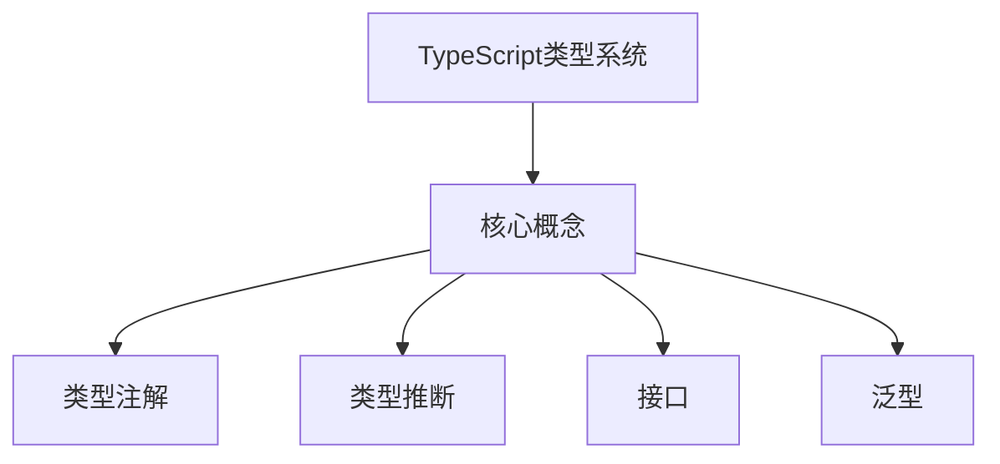

---

### 2. 流程图（Flow Diagram）
**用途**：展示处理步骤和工作流程  
**触发关键词**：流程、步骤、过程、flow、steps、process  
**示例场景**：
```markdown
写一篇关于数据处理流程的文章
写一篇关于部署步骤的文章
```

**生成效果**：
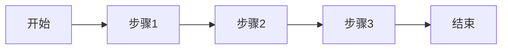

---

### 3. 架构图（Architecture Diagram）
**用途**：展示系统架构和组件关系  
**触发关键词**：架构、系统、部署、Docker、Kubernetes、microservice、architecture、system、deployment  
**示例场景**：
```markdown
写一篇关于Docker容器化部署的文章
写一篇关于微服务架构的文章
Write an article about Kubernetes microservices
```

**生成效果**：
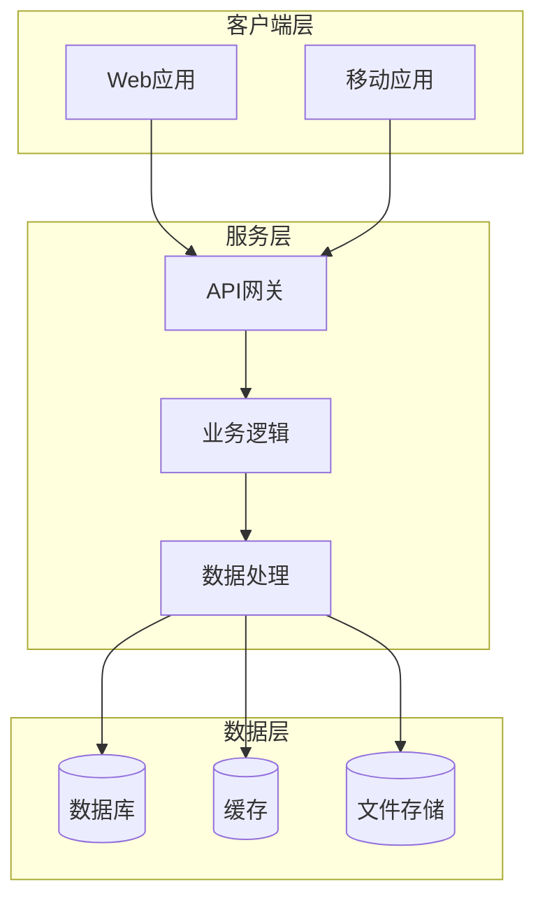

---

### 4. 类图（Class Diagram）
**用途**：展示类和对象的结构关系  
**触发关键词**：类、对象、OOP、面向对象、class、object、oop  
**示例场景**：
```markdown
写一篇关于Python面向对象编程的文章
写一篇关于设计模式的文章
```

**生成效果**：
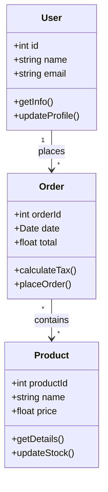

---

### 5. 状态图（State Diagram）
**用途**：展示状态转换和生命周期  
**触发关键词**：状态、生命周期、state、lifecycle  
**示例场景**：
```markdown
写一篇关于订单状态的文章
写一篇关于任务生命周期的文章
```

**生成效果**：
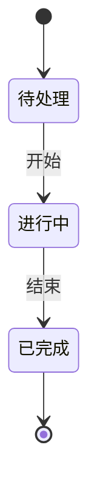

---

## 🌍 多语言支持

关系图的标签会根据文章语言自动切换：

### 中文文章
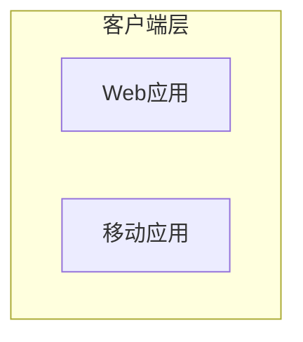

### 英文文章
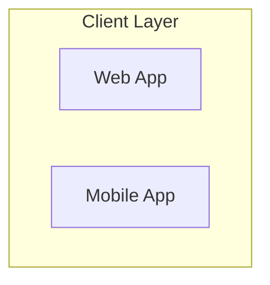

---

## 📍 插入位置

### 1. 概念关系图
**位置**：在"问题背景"之后、"解决方案"之前  
**目的**：帮助读者快速理解文章的核心概念

### 2. 架构图
**位置**：在"总结"之后  
**目的**：提供系统架构的整体视图

---

## 🔧 技术实现

### 自动选择算法
```python
def _get_best_diagram_type(self, topic: str, section: str) -> str:
    # 根据主题选择图表类型
    if any(kw in topic_lower for kw in ['class', '类', 'oop', '面向对象']):
        return 'class'
    elif any(kw in topic_lower for kw in ['state', '状态', 'lifecycle', '生命周期']):
        return 'state'
    elif any(kw in topic_lower for kw in ['flow', '流程', 'step', '步骤']):
        return 'flow'
    elif any(kw in topic_lower for kw in ['architecture', '架构', '系统', '部署', 'docker', 'kubernetes']):
        return 'architecture'
    else:
        return 'concept'
```

### 语言适配
```python
if self.language == "zh":
    diagram += "    subgraph 客户端层\n"
    diagram += "        A[Web应用]\n"
else:
    diagram += "    subgraph Client Layer\n"
    diagram += "        A[Web App]\n"
```

---

## 📝 使用示例

### 示例1：架构类文章
```bash
python scripts/search_and_write.py "Docker容器化架构设计" \
  --length medium \
  --style professional
```

**生成内容**：
- 架构图：展示客户端层、服务层、数据层
- 位置：问题背景后 + 总结后

---

### 示例2：流程类文章
```bash
python scripts/search_and_write.py "数据处理流程" \
  --length short \
  --style tutorial
```

**生成内容**：
- 流程图：展示从开始到结束的步骤
- 位置：问题背景后

---

### 示例3：英文架构文章
```bash
python scripts/search_and_write.py "Kubernetes microservices architecture" \
  --length long \
  --style professional \
  --language en
```

**生成内容**：
- 架构图（英文标签）
- 位置：问题背景后 + 总结后

---

### 示例4：OOP类文章
```bash
python scripts/search_and_write.py "Python面向对象编程" \
  --length medium \
  --style tutorial
```

**生成内容**：
- 类图：展示User、Order、Product类及其关系
- 位置：问题背景后

---

## 🎯 触发规则

### 自动触发（推荐）
只需在主题中包含相关关键词，关系图会自动生成：

| 图表类型 | 触发关键词 |
|---------|-----------|
| 概念图 | 默认（未匹配其他类型时） |
| 流程图 | 流程、步骤、过程、flow、step |
| 架构图 | 架构、系统、部署、Docker、Kubernetes、微服务 |
| 类图 | 类、对象、OOP、面向对象、class、object |
| 状态图 | 状态、生命周期、state、lifecycle |

### 主题适配示例

**架构类主题**：
- ✅ "Docker容器化部署" → 架构图
- ✅ "微服务架构设计" → 架构图
- ✅ "Kubernetes系统架构" → 架构图

**流程类主题**：
- ✅ "数据处理流程" → 流程图
- ✅ "部署步骤详解" → 流程图
- ✅ "工作流程优化" → 流程图

**OOP类主题**：
- ✅ "Python面向对象编程" → 类图
- ✅ "设计模式实践" → 类图
- ✅ "Java类与对象" → 类图

---

## 🎨 最佳实践

### 1. 选择合适的主题
**✅ 推荐**：
- 包含明确的技术关键词
- 适合可视化展示
- 具有明确的结构或关系

**⚠️ 避免**：
- 过于抽象的概念
- 没有明显结构的主题
- 纯理论性的主题

### 2. 配合写作风格

**Casual风格**：
- 关系图作为辅助理解工具
- 配合轻松的语言风格
- 用于吸引读者注意力

**Professional风格**：
- 关系图作为专业展示
- 配合严谨的论述
- 用于展示系统架构

**Tutorial风格**：
- 关系图作为学习辅助
- 配合步骤式讲解
- 用于帮助读者理解流程

### 3. 配合文章长度

**Short (500-800字)**：
- 适合简单的概念图或流程图
- 聚焦于核心要点
- 避免过于复杂的架构图

**Medium (800-1200字)**：
- 适合概念图+架构图组合
- 可以展示更完整的关系
- 平衡深度和广度

**Long (1200-2000字)**：
- 适合详细展示系统架构
- 可以包含多个关系图
- 深入讲解各个组件

---

## 🔍 查看生成的关系图

生成的文章中可以直接查看关系图：

```markdown
### 📊 Docker容器化架构设计 核心概念关系

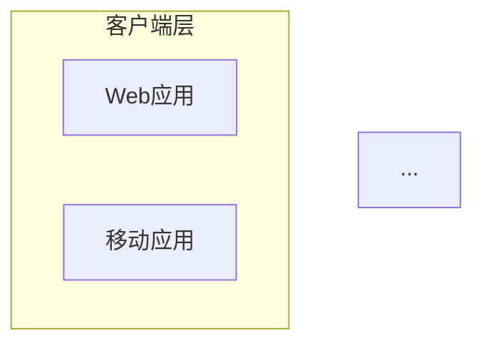
```

**渲染效果**：
- GitHub：自动渲染
- VS Code：安装 Mermaid 插件后渲染
- 在线编辑器：使用 Mermaid Live Editor

---

## 💡 高级技巧

### 1. 手动调整关系图
生成的关系图是标准的 Mermaid 代码，可以手动调整：

```markdown
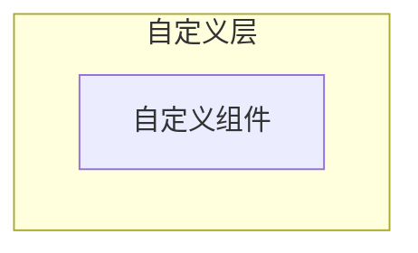
```

### 2. 组合多种关系图
可以在文章中手动添加多种关系图：

```markdown
## 系统架构

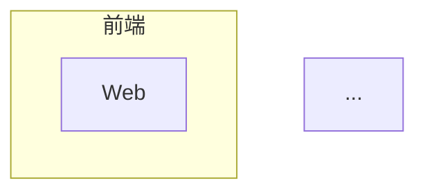

## 数据流

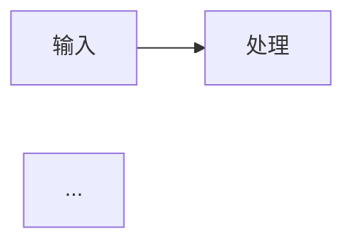
```

### 3. 自定义样式
Mermaid 支持自定义样式：

```markdown
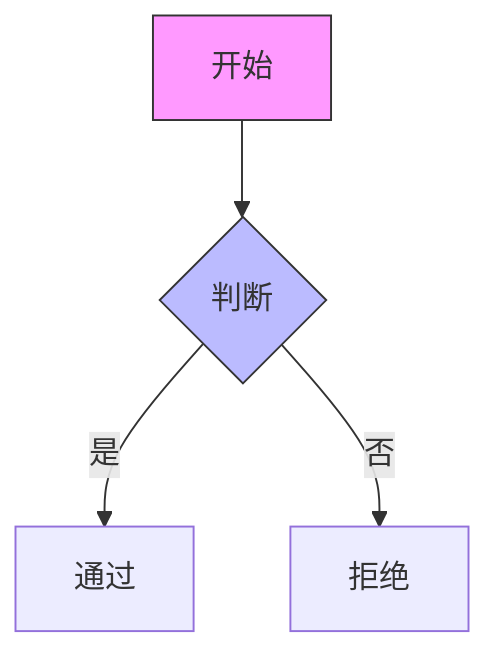
```

---

## 🐛 常见问题

### Q1：关系图没有生成
**原因**：主题关键词未匹配到图表类型  
**解决**：
- 检查主题中是否包含触发关键词
- 尝试使用更明确的技术关键词
- 确认搜索功能正常工作

### Q2：生成的图表类型不对
**原因**：关键词匹配到了其他图表类型  
**解决**：
- 使用更具体的关键词
- 例如：用"类图"而非"面向对象"

### Q3：英文文章显示中文标签
**原因**：语言配置未正确应用  
**解决**：
- 确认使用 `--language en` 参数
- 确保主题描述为英文

### Q4：关系图显示不完整
**原因**：概念名称过长  
**解决**：
- 使用简化的概念名称
- 手动调整图表结构

---

## 📚 相关文档

- [README.md](README.md) - 完整使用说明
- [SKILL.md](SKILL.md) - Skill详细定义
- [QUICK_START.md](QUICK_START.md) - 快速开始指南
- [templates/article_template.md](templates/article_template.md) - 文章模板

---

## 🎉 使用建议

1. **优先使用架构类关键词**：Docker、Kubernetes、microservice 等
2. **配合合适的写作风格**：professional 风格更适合架构图
3. **选择合适的文章长度**：long 模式可以生成更详细的图表
4. **结合多语言支持**：英文文章使用英文标签
5. **手动调整**：如需更精细的控制，可以手动修改 Mermaid 代码

---

**功能版本**：v2.1.0  
**更新日期**：2026-01-20  
**技术栈**：Mermaid.js  

*让技术文章更加直观、专业！*
