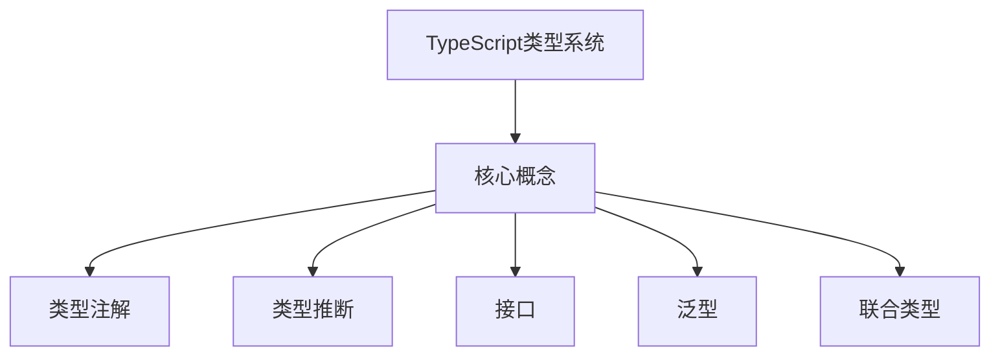
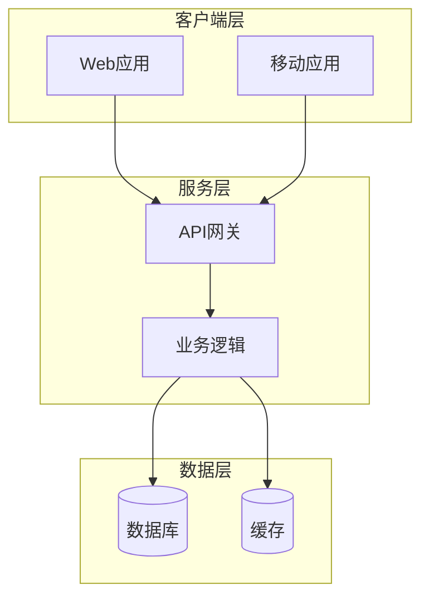
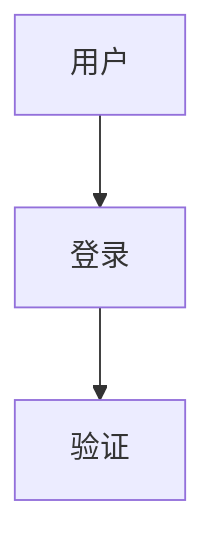
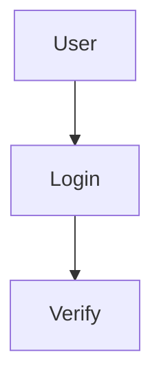

# 编程文章写手

## 📋 功能概述
专业的编程技术文章生成工具，通过联网搜索获取最新、最准确的技术资料，结合用户的具体需求，生成语言风格自然流畅、技术内容逻辑严密的短篇编程文章（500-2000字，可配置）。文章遵循"问题→方案→示例→验证→总结"的经典结构，可直接用于技术博客发布。

**v2.1 新增功能**：
- ✅ **智能关系图**：自动根据主题生成Mermaid关系图
- ✅ **5种图表类型**：概念图、流程图、架构图、类图、状态图
- ✅ **自动插入**：在适当位置自动插入关系图
- ✅ **多语言支持**：中英文关系图标签
- ✅ **主题适配**：根据关键词自动选择最佳图表类型

## 🎯 使用场景
- **技术博客写作**：写一篇关于某项技术最佳实践的文章
- **学习笔记整理**：把学习某项技术的收获整理成文章
- **经验分享**：分享开发中遇到的问题和解决方案
- **新技术探索**：探索新兴技术并写成介绍性文章

## 🚀 快速开始

### 触发Skill
直接对 Opencode 说以下任一句：
- "写一篇关于React Hooks最佳实践的文章"
- "写一篇Python异步编程的文章"
- "帮我写一篇Docker容器化部署的文章"
- "编程文章：如何写出更好的代码"

### 示例对话

**User**: 写一篇关于TypeScript类型安全的文章

**Opencode**: [识别到编程文章写手]
1. 正在搜索TypeScript类型安全相关资料...
2. 搜索GitHub示例...
3. 搜索官方文档...
4. 分析资料并规划结构...
5. 生成文章内容...

**Output**: ✅ TypeScript类型安全文章已生成
📁 文件路径：`./typescript_type_safety_article_20260120.md`
📝 字数统计: 950字
📊 文章长度: medium (800-1200字)
🎨 文章风格: casual
🌐 语言: zh

### 高级用法

**指定文章长度**：
```
User: 写一篇关于React性能优化的文章，要求详细一些
Opencode: [识别到编程文章写手] 使用长篇模式...
```

**指定写作风格**：
```
User: 写一篇专业的TypeScript类型系统文章
Opencode: [识别到编程文章写手] 使用专业风格...
```

**英文文章**：
```
User: Write an article about Docker containerization best practices
Opencode: [识别到编程文章写手] 生成英文文章...
```

### 实际效果

**输入**：
```
用户：写一篇关于GitHub Copilot最佳实践的文章

要求：
- 重点介绍如何提升代码补全效率
- 包含实际使用技巧
- 适合中级开发者阅读
```

**输出**：
```markdown
# GitHub Copilot 最佳实践：让代码补全效率翻倍的实用技巧

## 写在前面

作为一名开发者，你是否曾被重复的样板代码折磨得心力交瘁？...

## 一、理解Copilot的工作原理

Copilot并非魔法，它基于...
```

---

## 📁 输入/输出

### 输入
- **主题描述**：用户用自然语言描述想要写的文章主题和要求
  - 格式：自然语言描述
  - 必需：是
  - 示例："写一篇关于React性能优化的文章，重点介绍useMemo和useCallback的使用"

### 配置选项（可选）
| 配置项 | 选项 | 默认值 | 说明 |
|--------|------|--------|------|
| 文章长度 | short, medium, long | medium | short: 500-800字, medium: 800-1200字, long: 1200-2000字 |
| 写作风格 | casual, professional, tutorial | casual | casual: 轻松自然, professional: 专业严谨, tutorial: 教程式 |
| 输出语言 | zh, en | zh | zh: 中文, en: 英文 |
| 额外关键词 | 逗号分隔的关键词列表 | 无 | 帮助搜索更精准 |

### 输出
- **Markdown文件**：标准Markdown格式的技术文章文件
  - 文件命名：`<主题>_article_YYYYMMDD.md`
  - 字数范围：根据配置（500-2000字）
  - 结构：问题→方案→示例→验证→总结
  - 保存位置：用户指定目录或当前工作目录
  - 元信息：标题、日期、标签、描述

### 输出格式示例
```markdown
---
title: "<文章标题>"
date: YYYY-MM-DD
tags: [tag1, tag2, tag3]
description: <文章描述>
---

# <文章标题>

## 写在前面
<引入段落，建立与读者的连接>

## 一、问题背景
<描述要解决的核心问题>

## 二、解决方案
<介绍解决方案和原理>

## 三、代码示例
<提供具体的代码示例>

## 四、效果验证
<验证方案的有效性>

## 五、总结
<总结核心要点>

---
*本文由编程文章写手Skill v2.0自动生成*
```

## 📊 关系图支持

### 自动关系图类型
| 图表类型 | 适用场景 | 触发关键词 |
|---------|---------|-----------|
| **概念关系图** | 展示核心概念和它们之间的关系 | 概念、原理、核心 |
| **流程图** | 展示处理步骤和工作流程 | 流程、步骤、过程 |
| **架构图** | 展示系统架构和组件关系 | 架构、系统、部署、Docker、Kubernetes |
| **类图** | 展示类和对象的结构关系 | 类、对象、OOP、面向对象 |
| **状态图** | 展示状态转换和生命周期 | 状态、生命周期 |

### 使用关系图

关系图会根据主题自动生成，无需额外配置：

```bash
# 架构类主题（自动添加架构图）
写一篇关于Docker容器化部署的文章

# 流程类主题（自动添加流程图）
写一篇关于数据处理流程的文章

# 概念类主题（自动添加概念图）
写一篇关于TypeScript类型系统的文章

# 类相关主题（自动添加类图）
写一篇关于Python面向对象编程的文章
```

### 关系图示例

**概念关系图**：


**架构图**：


### 关系图语言
关系图的标签会根据选择的语言自动切换：

**中文**：


**English**：


### 基础用法
```bash
# 默认配置（medium长度，casual风格，中文）
写一篇关于TypeScript类型安全的文章
```

### 指定文章长度
```bash
# 短篇（500-800字）
写一篇关于React Hooks的文章，简短介绍即可

# 长篇（1200-2000字）
写一篇关于Docker容器化部署的详细文章，要求全面深入
```

### 指定写作风格
```bash
# 专业风格
写一篇专业的TypeScript类型系统文章

# 教程风格
写一篇教程：如何使用Python异步编程
```

### 英文文章
```bash
Write an article about Kubernetes best practices
```

### 组合使用
```bash
# 长篇、专业风格、英文
Write a detailed professional article about microservices architecture in English
```

### 带关键词搜索
```bash
写一篇关于React性能优化的文章，重点关注useMemo和useCallback
```

## 📚 相关文档
- [SKILL.md](SKILL.md) - 技能详细说明
- [scripts/search_and_write.py](scripts/search_and_write.py) - 文章生成脚本（v2.0）
- [templates/article_template.md](templates/article_template.md) - 文章模板

## 🔧 命令行使用

本Skill也支持直接通过命令行使用：

```bash
# 基础用法
python scripts/search_and_write.py "TypeScript类型安全最佳实践"

# 指定文章长度
python scripts/search_and_write.py "React性能优化" --length long

# 指定写作风格
python scripts/search_and_write.py "Docker容器化" --style professional

# 指定输出语言
python scripts/search_and_write.py "Kubernetes basics" --language en

# 组合使用
python scripts/search_and_write.py "Microservices" --length long --style professional --language en

# 指定输出目录
python scripts/search_and_write.py "Python异步编程" --output-dir ./articles

# 添加关键词
python scripts/search_and_write.py "React Hooks" --keywords "useMemo,useCallback,性能优化"
```

## 🐛 故障排除

### 问题1：生成的文章太短/太长
**症状**：文章字数不符合预期范围  
**原因**：主题过于宽泛或狭窄，或未指定合适的长度配置  
**解决**：
- 明确指定文章长度：使用"简短介绍"（short）或"详细文章"（long）
- 在主题描述中提供更多细节
- 检查配置是否正确应用

### 问题2：技术内容不够准确
**症状**：文章中的技术描述存在错误或过时信息  
**原因**：搜索到的资料不够权威或版本过旧  
**解决**：
- Skill会自动优先搜索官方文档和高质量技术博客
- 可以要求重新搜索或补充特定关键词
- 检查搜索结果的相关性

### 问题3：文章风格不符合预期
**症状**：生成的语言风格不符合要求  
**原因**：未明确指定风格或风格选择不当  
**解决**：
- 明确指定风格：casual（轻松）、professional（专业）、tutorial（教程）
- 在主题描述中说明期望的语气和风格
- 尝试不同的风格配置

### 问题4：文件保存失败
**症状**：提示无法写入文件  
**原因**：目录不存在或没有写权限  
**解决**：
- 确认目录存在且有写权限
- 指定其他保存路径
- 检查文件系统权限

### 问题5：搜索结果不理想
**症状**：搜索到的资料质量不高或不相关  
**原因**：主题描述不够具体或关键词不准确  
**解决**：
- 提供更具体的主题描述
- 添加相关关键词
- 尝试不同的搜索角度

### 问题6：语言不符合预期
**症状**：生成的文章不是期望的语言  
**原因**：未指定输出语言或语言配置错误  
**解决**：
- 明确指定语言：zh（中文）或 en（英文）
- 使用对应语言的触发词

## 💡 使用技巧

1. **具体化需求**：越具体的描述生成的文章越符合预期
   - ❌ "写一篇Python的文章"
   - ✅ "写一篇Python异步编程的文章，重点介绍asyncio的用法"

2. **指定目标读者**：帮助AI更好地把握文章深度
   - "适合初级开发者"
   - "适合有经验的Go开发者"

3. **强调重点内容**：告诉AI你希望文章侧重哪部分
   - "多举些代码示例"
   - "重点讲原理，少举例"

4. **指定文章长度**：根据需求选择合适的长度
   - "简短介绍" → short (500-800字)
   - "详细讲解" → medium (800-1200字)
   - "全面深入" → long (1200-2000字)

5. **指定写作风格**：让文章更有个性
   - "轻松自然" → casual
   - "专业严谨" → professional
   - "教程式" → tutorial

6. **多语言写作**：支持中英文输出
   - 中文：使用中文描述主题
   - 英文：使用英文描述主题

7. **组合配置**：可以同时指定多个参数
   - "写一篇专业的TypeScript类型系统文章，要求详细深入"
   - "Write a detailed tutorial about React Hooks in English"

## 📝 更新日志
- v2.1.0 (2026-01-20): 重大升级
  - ✨ **新增智能关系图**：自动生成Mermaid关系图
  - ✨ 新增5种图表类型：概念图、流程图、架构图、类图、状态图
  - ✨ 自动根据主题选择最佳图表类型
  - ✨ 多语言关系图标签（中英文）
  - ✨ 在适当位置自动插入关系图
  - ✨ 新增架构图在总结后展示
- v2.0.0 (2026-01-20): 重大升级
  - ✨ 新增三种文章长度配置：short、medium、long
  - ✨ 新增三种写作风格：casual、professional、tutorial
  - ✨ 新增多语言支持：中文/英文
  - ✨ 增强搜索功能，整合更多资料源
  - ✨ 完善错误处理和输入验证
- v1.0.0 (2026-01-20): 初始版本，支持联网搜索和短篇编程文章生成
