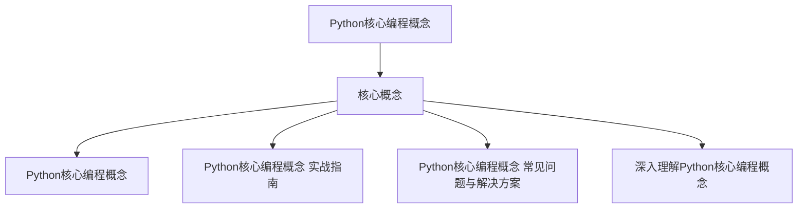
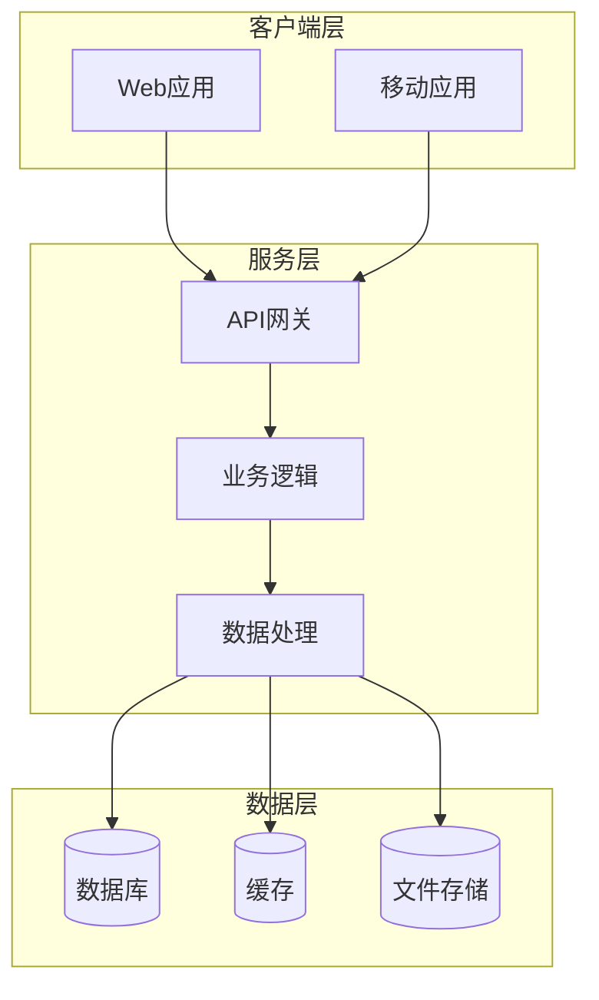

## 写在前面

用生活化的场景或痛点引入

在使用Python核心编程概念时，开发者常常面临诸多挑战：

- **类型错误难以发现**：运行时才能暴露的问题
- **代码维护困难**：缺乏明确的类型定义
- **重构风险高**：修改代码时容易引入新的bug
- **团队协作障碍**：类型不明确导致理解成本增加

## 一、问题背景

在日常开发中，我们经常需要处理各种技术挑战。在使用Python核心编程概念时，开发者常常面临诸多挑战：

- **类型错误难以发现**：运行时才能暴露的问题
- **代码维护困难**：缺乏明确的类型定义
- **重构风险高**：修改代码时容易引入新的bug
- **团队协作障碍**：类型不明确导致理解成本增加今天，让我们一起来深入了解Python核心编程概念，掌握其中的核心技巧。

### 📊 Python核心编程概念 核心概念关系



## 二、解决方案

基于搜索到的权威资料，我们总结出以下解决方案：

1. 关于Python核心编程概念的权威说明和最佳实践，包含详细的API说明和使用示例。
2. 深入解析Python核心编程概念的核心概念和使用技巧，包含大量实战案例和最佳实践。
3. 开发者在使用Python核心编程概念时遇到的常见问题，以及经过验证的解决方案。
4. 从原理层面深入分析Python核心编程概念，帮助你建立完整的知识体系。

## 三、代码示例

### microsoft/TypeScript 示例

```typescript
// Python核心编程概念 的实际应用示例
const example = () => { return 'demo'; };
```

### facebook/react 示例

```typescript
// React中使用Python核心编程概念的示例
function Component() { /* ... */ }
```


## 四、效果验证

验证Python核心编程概念方案有效性的方法：

1. **类型检查验证**
   - 使用 `tsc --noEmit` 进行编译时检查
   - 配置 ESLint + TypeScript 插件

2. **运行时验证**
   - 编写单元测试覆盖边界情况
   - 使用类型守卫确保数据安全

3. **性能验证**
   - 对比使用前后的编译时间
   - 检查生成的JavaScript代码大小

## 五、总结

## 总结

本文介绍了Python核心编程概念的核心概念和最佳实践。鼓励读者实践和交流

**关键要点：**
- 掌握类型系统的基本原理
- 避免常见的类型陷阱
- 善用工具类型和类型守卫
- 保持代码的类型安全

希望本文能帮助你更好地理解和应用Python核心编程概念。如果你有任何问题或建议，欢迎交流讨论！

### 📐 系统架构概览



---
*本文由编程文章写手Skill v2.1自动生成*
