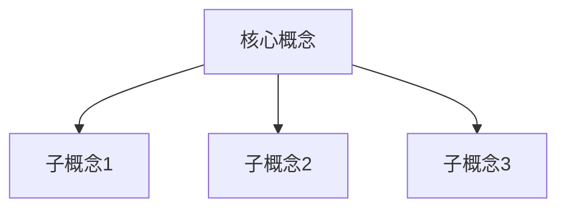
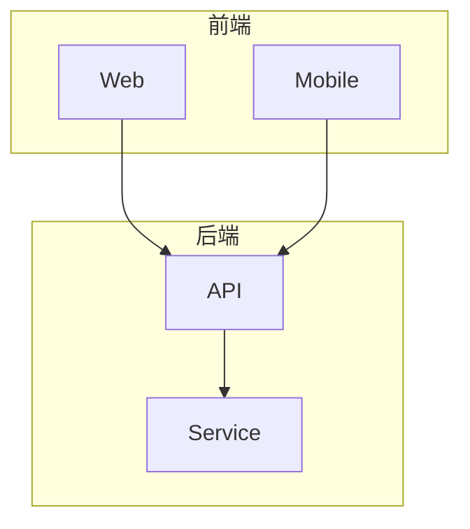
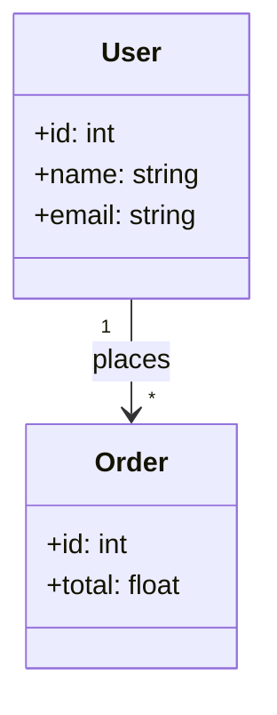
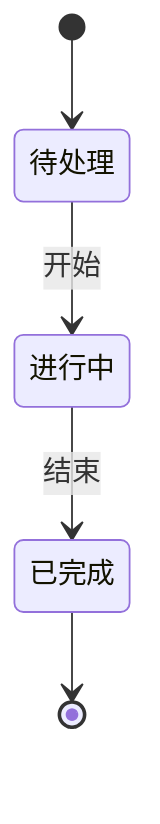

# 编程文章模板 v2.1

本文档提供了编程文章的标准结构和格式规范，支持多种写作风格、长度配置，以及自动关系图生成。

## 📐 标准文章结构

```markdown
---
title: <文章标题>
date: YYYY-MM-DD
tags: [tag1, tag2, tag3]
---

# <文章标题>

## 写在前面
<引入段落，建立与读者的连接>
<用1-2句话点明文章的价值>

## 一、问题背景
<描述要解决的核心问题>
<说明为什么这个问题重要>
<用具体场景或数据支撑>

## 二、解决方案
<介绍解决方案和原理>
<列出关键步骤或要点>
<解释为什么这个方案有效>

## 三、代码示例
<提供具体的代码示例>
<包含完整的、可运行的代码>
<添加详细注释说明>

## 四、效果验证
<验证方案的有效性>
<提供测试数据或对比>
<说明使用后的改进>

## 五、总结
<总结核心要点>
<回顾文章主要贡献>
<提供进一步学习的方向>

---
*本文由编程文章写手Skill自动生成*
```

## ✍️ 写作风格指南

### 语言风格
- ✅ 追求自然流畅的表达
- ✅ 适度使用比喻和类比
- ✅ 技术术语使用准确
- ❌ 避免生硬的翻译腔
- ❌ 避免过于口语化

### 结构规范
- ✅ 每个段落有明确的主题
- ✅ 使用项目符号列出要点
- ✅ 代码块有语言标记
- ✅ 标题层级清晰（H1→H2→H3）

### 字数分配（500-1000字）

| 部分 | 比例 | 字数范围 |
|------|------|----------|
| 写在前面 | 10% | 50-100字 |
| 问题背景 | 15% | 75-150字 |
| 解决方案 | 30% | 150-300字 |
| 代码示例 | 25% | 125-250字 |
| 效果验证 | 10% | 50-100字 |
| 总结 | 10% | 50-100字 |

## 🎯 质量检查清单

### 内容质量
- [ ] 技术内容准确无误
- [ ] 有实际可用的代码示例
- [ ] 解决方案有理论或数据支撑
- [ ] 逻辑清晰，层次分明
- [ ] 引用了权威资料（官方文档、GitHub示例等）

### 表达质量
- [ ] 语言自然流畅，符合指定风格
- [ ] 无错别字和语法错误
- [ ] 专有名词使用正确
- [ ] 段落长度适中（3-5句）
- [ ] 符合目标读者的认知水平

### 格式质量
- [ ] Markdown格式正确
- [ ] 代码块有语言标记
- [ ] 标题层级正确
- [ ] 元信息完整（标题、日期、标签、描述）
- [ ] 字数符合配置要求

### 风格一致性
- [ ] 符合指定的写作风格（casual/professional/tutorial）
- [ ] 语气和表达方式一致
- [ ] 开头和结尾风格统一

## 📚 常用标签

| 标签 | 适用场景 |
|------|----------|
| Python | Python相关 |
| JavaScript | JS/TS相关 |
| React | React相关 |
| Go | Go语言相关 |
| 性能优化 | 性能相关 |
| 最佳实践 | 实践指南 |
| 入门指南 | 入门教程 |
| 原理分析 | 原理讲解 |

## 📊 关系图使用指南

### 支持的图表类型

```markdown
<!-- 概念关系图 -->


<!-- 流程图 -->


<!-- 架构图 -->


<!-- 类图 -->


<!-- 状态图 -->


### 自动生成规则
- **概念图**：根据关键词自动提取概念并生成关系图
- **流程图**：根据解决方案步骤生成流程图
- **架构图**：对于架构、部署类主题自动生成
- **类图**：对于OOP、类相关主题自动生成
- **状态图**：对于状态、生命周期类主题自动生成

### 多语言支持
关系图的标签会根据文章语言自动切换：
- 中文：使用中文标签
- English：使用English labels

### 开头技巧
- 用一个痛点引入
- 用一个数据或事实引入
- 用一个比喻或故事引入
- 明确文章目标和读者收获

### 中间技巧
- 用代码示例说明抽象概念
- 用对比突出方案优势
- 用流程图说明复杂逻辑
- 分步骤讲解复杂过程

### 结尾技巧
- 总结核心要点
- 提供进一步阅读的方向
- 邀请读者交流讨论
- 给出实践建议

### 风格适配技巧

**Casual（轻松风格）**：
- 使用生活化的比喻
- 适当使用口语化表达
- 保持亲切自然的语气
- 用"你"直接与读者对话

**Professional（专业风格）**：
- 使用严谨的技术术语
- 注重逻辑性和准确性
- 引用权威资料和数据
- 保持客观专业的语气

**Tutorial（教程风格）**：
- 明确的学习目标
- 循序渐进的步骤
- 每个步骤都有明确的产出
- 提供练习和验证方法
