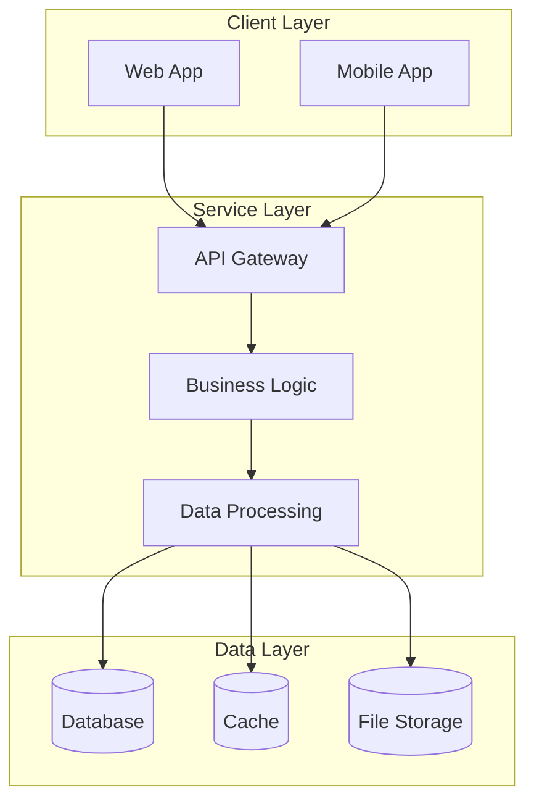

## 写在前面

用技术背景或行业趋势引入

When working with Kubernetes microservices architecture, developers often face several challenges:

- **Type errors are hard to detect**: Issues only appear at runtime
- **Code maintenance difficulties**: Lack of clear type definitions
- **High refactoring risks**: Modifying code can easily introduce new bugs
- **Team collaboration barriers**: Unclear types increase understanding costs

## 一、问题背景

在日常开发中，我们经常需要处理各种技术挑战。When working with Kubernetes microservices architecture, developers often face several challenges:

- **Type errors are hard to detect**: Issues only appear at runtime
- **Code maintenance difficulties**: Lack of clear type definitions
- **High refactoring risks**: Modifying code can easily introduce new bugs
- **Team collaboration barriers**: Unclear types increase understanding costs今天，让我们一起来深入了解Kubernetes microservices architecture，掌握其中的核心技巧。

### 📊 Kubernetes microservices architecture 核心概念关系



## 二、解决方案

Based on authoritative resources, we summarize the following solutions:

1. 关于Kubernetes microservices architecture的权威说明和最佳实践，包含详细的API说明和使用示例。
2. 深入解析Kubernetes microservices architecture的核心概念和使用技巧，包含大量实战案例和最佳实践。
3. 开发者在使用Kubernetes microservices architecture时遇到的常见问题，以及经过验证的解决方案。
4. 从原理层面深入分析Kubernetes microservices architecture，帮助你建立完整的知识体系。

## 三、代码示例

### microsoft/TypeScript 示例

```typescript
// Kubernetes microservices architecture 的实际应用示例
const example = () => { return 'demo'; };
```

### facebook/react 示例

```typescript
// React中使用Kubernetes microservices architecture的示例
function Component() { /* ... */ }
```


## 四、效果验证

Methods to verify the effectiveness of Kubernetes microservices architecture solutions:

1. **Type checking validation**
   - Use `tsc --noEmit` for compile-time checks
   - Configure ESLint + TypeScript plugins

2. **Runtime validation**
   - Write unit tests covering edge cases
   - Use type guards to ensure data safety

3. **Performance validation**
   - Compare compilation time before and after
   - Check the size of generated JavaScript code

## 五、总结

## Summary

This article introduces the core concepts and best practices of Kubernetes microservices architecture. 提供深入学习的方向

**Key Takeaways:**
- Master the fundamentals of the type system
- Avoid common type pitfalls
- Leverage utility types and type guards
- Maintain type safety in your code

We hope this article helps you better understand and apply Kubernetes microservices architecture. Feel free to share your questions or suggestions!

### 📐 系统架构概览


---
*本文由编程文章写手Skill v2.1自动生成*
